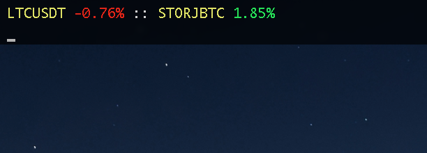

# Crypticker

Simple tool for monitoring price movements of your assets in realtime with websockets. I tend to have it across the top of the screen using iTerm2 under macos like so:



## Usage
Create a ~/.crypto/ticker.toml file with a configuration like so:
```toml
[binance]
STORJ_BTC = 0.00002492
LTC_USDT = 118.59
```

Run the tool with `cryptick` and a socket will be created for each asset. The second value is your entry price. The price variation will be shown as a % of your entry.
